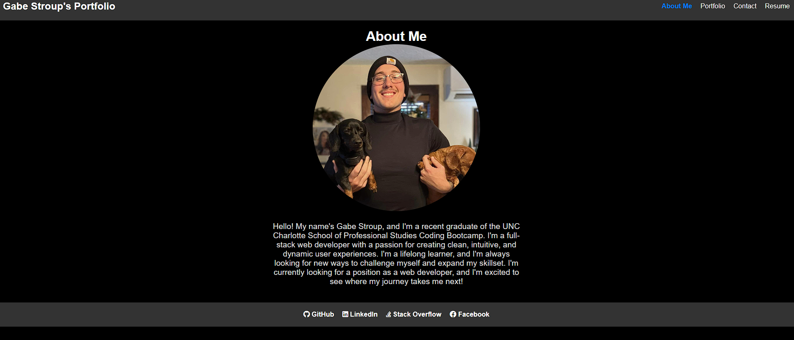

# React Portfolio


## Description

This is a portfolio built using React. It is a single page application that uses React Router to navigate between pages. It is styled using Material UI. It is deployed on netlify.



## Table of Contents

* [Installation](#installation)
* [Usage](#usage)
* [License](#license)
* [References](#references)
* [Questions](#questions)

## Installation

To install the necessary dependencies, run the following command:

``` npm i ``` 

## Usage

To run the application, run the following command:

``` npm start ```

## License

This project is licensed under the MIT license.

## References

Wrapping Route with Routes: https://reactrouter.com/en/main/router-components/browser-router

Adding an Avatar: https://mui.com/material-ui/react-avatar/#image-avatars

Installing Material UI: https://mui.com/getting-started/installation/

Lines 49 - 57 in Portfolio: Sourced from ChatGPT

EmailJS integration in Contact: https://www.emailjs.com/docs/examples/reactjs/

Contact Template: https://codepen.io/JonLehman/pen/yOdbOG

PDF implementation: https://medium.com/@stheodorejohn/a-guide-to-display-pdf-documents-in-react-bcd9fb0f56b0#:~:text=The%20simplest%20way%20to%20display,URL%20of%20the%20PDF%20file.

All Icons are from FontAwesome: https://fontawesome.com/

## Questions

If you have any questions about the repo, open an issue or contact me directly at [gstroup11@gmail.com]
